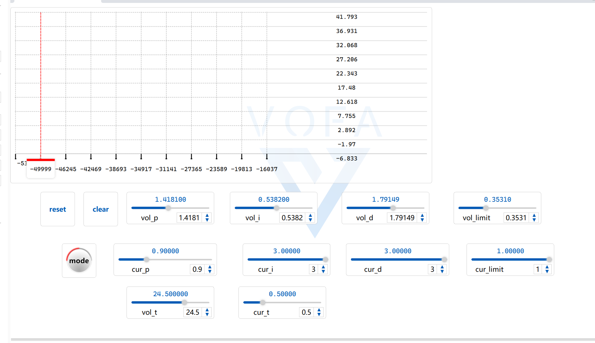

# STM32_NUEDC_LIB
---
### 1、工程目录
- **App** **->存放应用层代码**
  - algorithim **->算法抽象层，比如PID、DC-DC、DC-AC等算法的模板** 
    - Inc **->由于模板不能定义在源文件中，因此所有类实现和方法都写在头文件里，放到Inc目录下**
    - Src
  - filiter **->滤波器抽象层，比如低通滤波、高通滤波、卡尔曼滤波等算法** 
    - Inc **->由于这些算法到时可能会用DSP库去优化，因此也用模板实现，实现也写到头文件里，放到Inc目录下**
    - Src
- **Core** ->HAL库生成的硬件初始化目录，不用多说
  - Inc
  - Src
  - Startup
- **Drivers** ->HAL库驱动，不用多说
  - CMSIS
  - STM32xxxx_HAL_Driver
- **Hardware**  **->为硬件驱动封装对应的方法**
  - hal **->硬件方法抽象层，用concept去约束硬件应该具有某些行为，用于适配App文件夹下的算法抽象层**
    - Inc **->concept的定义，全部放到Inc文件夹下**
    - Src
  - port **->port是“portable"-可移植的缩写，在这个文件夹下对应了某个硬件平台下该外设的具体实现方法，比如针对stm32的adc，那么这里就需要引入HAL库与adc相关的内容，针对电赛中adc常用的功能进行封装**
    - Inc **->对应的类的实现定义在了Inc中，这些类的方法名需要与Hardware/hal/Inc下对应的concept定义的方法名一样，否则无法实现静态多态**
    - Src
- **Port** **->参考设计模式中的"工厂模式"，为类的实例化提供具体的构造方法**
    - Inc **->使用cpp的命名空间来防止变量或函数名重名，为了在main.cpp中获得对应的句柄，无需考虑初始化细节**
    - Src **->只需存放一个源文件，用于存放HAL库提供的回调函数实现**
---
### 2、设计原则
#### <span style="color:rgb(165, 27, 27);">(1)库的类和类方法实现全部放到头文件</span>
##### 原因:类方法放到头文件中，编译器会自动将对应的成员方法内联，即在调用处直接插入该函数方法，避免函数调用的出入栈开销，而且更加简洁明了
#### <span style="color:rgb(165, 27, 27);">(2)使用concept去约束模板参数，使用模板类去实现继承，从而实现静态多态，避免使用虚函数引入运行时的开销</span>
##### 原因:cpp的模板是为了实现泛型去做的，而concept则是用来约束模板参数，通过concept可以实现算法与硬件层的解耦，可以参考下面的说明:
* 将需要实现多态的组件写作一个concept，可以理解concept为是模板约束
* 定义一个模板类，包含了上述需要实现多态的组件，模板参数是上面定义的concept模板约束
```cpp
#include <concepts>
#include <cstdint>
#include <algorithm>
#include <iostream>

// 模拟Arduino和GPIO的宏定义（仅作为示例）
#define A0 0
#define GPIO_PIN5 5

// *********************** 定义硬件接口的 Concepts *************************

// PWM 控制器 Concept，要求类型 T 必须提供 setDutyCycle、getMaxFrequency 和 setFrequency 接口
template<typename T>
concept PWMControllerConcept = requires(T t, float duty, float freq) {
    { t.setDutyCycle(duty) } -> std::same_as<void>;
    { t.getMaxFrequency() } -> std::convertible_to<float>;
    { t.setFrequency(freq) } -> std::same_as<void>;
};

// ADC 接口 Concept，要求类型 T 必须提供 readVoltage 和 readCurrent 方法
template<typename T>
concept ADCInterfaceConcept = requires(T t) {
    { t.readVoltage() } -> std::convertible_to<float>;
    { t.readCurrent() } -> std::convertible_to<float>;
};

// GPIO 接口 Concept，要求类型 T 必须提供 setState 和 getState 方法
template<typename T>
concept GPIOPortConcept = requires(T t, bool state) {
    { t.setState(state) } -> std::same_as<void>;
    { t.getState() } -> std::convertible_to<bool>;
};

// **************************** 静态多态的转换器策略 ****************************

// Buck Converter（降压转换器）
template<PWMControllerConcept PWM, ADCInterfaceConcept ADC, GPIOPortConcept GPIO>
class BuckConverter {
public:
    BuckConverter(PWM pwm, ADC adc, GPIO gpio, float vinNominal)
        : pwm_(std::move(pwm)),
          adc_(std::move(adc)),
          gpio_(std::move(gpio)),
          vinNominal_(vinNominal) {}

    void initialize() {
        pwm_.setFrequency(100000);  // 设置频率为 100kHz
        enable(false);
    }

    void setOutputVoltage(float vout) {
        // 理论上 duty = vout / vinNominal
        float duty = vout / vinNominal_;
        duty = std::clamp(duty, MIN_DUTY, MAX_DUTY);
        pwm_.setDutyCycle(duty);
        // 此处可以添加闭环控制逻辑
    }

    void enable(bool state) {
        gpio_.setState(state);
    }

private:
    PWM pwm_;
    ADC adc_;
    GPIO gpio_;
    float vinNominal_;
    inline static constexpr float MAX_DUTY = 0.95f;
    inline static constexpr float MIN_DUTY = 0.05f;
};

// Boost Converter（升压转换器）
template<PWMControllerConcept PWM, ADCInterfaceConcept ADC, GPIOPortConcept GPIO>
class BoostConverter {
public:
    BoostConverter(PWM pwm, ADC adc, GPIO gpio, float vinNominal)
        : pwm_(std::move(pwm)),
          adc_(std::move(adc)),
          gpio_(std::move(gpio)),
          vinNominal_(vinNominal) {}

    void initialize() {
        pwm_.setFrequency(50000);  // 设置频率为 50kHz
        enable(false);
    }

    void setOutputVoltage(float vout) {
        // 理论上 duty = 1 - (vinNominal / vout)
        float duty = 1.0f - (vinNominal_ / vout);
        duty = std::clamp(duty, MIN_DUTY, MAX_DUTY);
        pwm_.setDutyCycle(duty);
        // 此处可以添加闭环控制逻辑
    }

    void enable(bool state) {
        gpio_.setState(state);
    }

private:
    PWM pwm_;
    ADC adc_;
    GPIO gpio_;
    float vinNominal_;
    inline static constexpr float MAX_DUTY = 0.95f;
    inline static constexpr float MIN_DUTY = 0.05f;
};

// **************************** 硬件平台实现示例 ****************************

// STM32平台PWM实现（不再使用虚函数而直接提供具体实现）
class STM32PWM {
public:
    STM32PWM(uint8_t channel) : channel_(channel) {}

    void setDutyCycle(float duty) {
        // STM32具体实现（这里只做示例输出）
        std::cout << "STM32PWM (Channel " << unsigned(channel_)
                  << ") set duty cycle to " << duty << "\n";
    }

    float getMaxFrequency() const { return 1e6; }

    void setFrequency(float freq) {
        // STM32设置频率（示例输出）
        std::cout << "STM32PWM (Channel " << unsigned(channel_)
                  << ") set frequency to " << freq << "\n";
    }

private:
    uint8_t channel_;
};

// Arduino平台ADC实现
class ArduinoADC {
public:
    ArduinoADC(uint8_t pin) : pin_(pin) {}

    float readVoltage() {
        // 模拟读取电压
        std::cout << "ArduinoADC (Pin " << unsigned(pin_) << ") reading voltage\n";
        return 3.3f;
    }

    float readCurrent() {
        // 模拟读取电流
        std::cout << "ArduinoADC (Pin " << unsigned(pin_) << ") reading current\n";
        return 0.1f;
    }

private:
    uint8_t pin_;
};

// GPIO 实现（例如 STM32/Arduino GPIO 均可这样实现）
class GPIOPortImpl {
public:
    GPIOPortImpl(uint8_t pin) : pin_(pin), state_(false) {}

    void setState(bool enable) {
        state_ = enable;
        std::cout << "GPIO (Pin " << unsigned(pin_) << ") state set to " << (enable ? "ON" : "OFF") << "\n";
    }

    bool getState() const { return state_; }

private:
    uint8_t pin_;
    bool state_;
};

// **************************** 使用示例 ****************************
int main() {
    // 创建硬件依赖对象（直接构造，不再使用智能指针）
    STM32PWM stm32Pwm(3);
    ArduinoADC arduinoAdc(A0);
    GPIOPortImpl enablePin(GPIO_PIN5);

    // 创建 Buck 转换器实例（降压转换器）
    BuckConverter converter(stm32Pwm, arduinoAdc, enablePin, 12.0f /* 输入电压 */);

    converter.initialize();
    converter.enable(true);
    converter.setOutputVoltage(5.0f);  // 设置目标输出电压

    return 0;
}
```
#### <span style="color:rgb(165, 27, 27);">(3)预先分配好对应平台的硬件资源，无需每次更换项目后重新配置
##### 我们的电源题也就用PWM和ADC这两个东西，除此之外，还添加了DMA以及一些优化机制，比如使用ADC的注入组，实现ADC的转换可以由输出PWM的定时器触发，确保采样到的值刚好是当前时刻斩波后的电压
##### 另外，配置了串口的空闲中断+DMA接收，这样可以确保每次功能开发完后，可以通过VOFA调试PID、模式切换等，而且这样就省去了需要写一个oled界面才能整机联调的尴尬局面

#### <span style="color:rgb(165, 27, 27);">(4)使用工厂模式为应用层提供接口
##### 在 Port/Inc 目录下用命名空间包含了一些函数，我举个例子，比如在stm32_adc.h下面，提供了获得ADC1的接口
```cpp
namespace stm32_adc
{
  Hardware_STM32_ADC getADC1()
  {
    Hardware_STM32_ADC adc;
    adc.begin(&hadc1, STM32_ADC_SINGLE_ENDED);
    return adc;
  }
}
```
##### 在main.cpp中引入对应的头文件，并定义一个全局变量
```cpp
#include "stm32_adc.h"

Hardware_STM32_ADC g_adc1_handler;

int main()
{
    g_adc1_handler=stm32_adc::getADC1();
}

```
##### 那要怎么使用它的api呢？请查看Port/Inc/stm32_test.h
```cpp
namespace stm32_test
{
  void timerA_pwm_test ()
  {
    g_hrtimerA_pwm_handler=stm32_hrtim_pwm::getTimerAOutput();
    g_hrtimerA_pwm_handler.setDutyCycle(0.3);
    g_hrtimerA_pwm_handler.setOutput();
  }

  void adc_dma_test ()
  {
    g_adc1_handler=stm32_adc::getADC1();
    g_adc1_handler.startSample();
    while(1)
      {
	static float voltage=0;
	static float current=0;
	voltage=g_adc1_handler.readVoltage();
	current=g_adc1_handler.readCurrent();
      }
  }
  //...常用的api及测试用例维护在这里，添加新功能时应把测试用例写在这个命名空间内，以便能随时测试模块是否能正常工作
```

---
### 3、命名风格
##### (1)对于库内容的文件，命名请参考已创建的文件名
##### (2)如果你想更新库的内容，请参考下面流程，比如我要添加卡尔曼滤波的算法:
* 思考，卡尔曼滤波算法是否和硬件无关？（不考虑DSP优化的话那确实是，其实一般都不考虑，因为要先跑起来再说）
* 如果是，那就直接在App/filiter/Inc下写一个类(不需要像BUCK一样是一个模板类，因为它硬件无关，不需要任何模板参数)，封装整个卡尔曼滤波的调用
* 由于是硬件无关的，那直接在Port/Inc下写一个stm32_kalman.h的工厂函数，以便调用者调用
* 在main.cpp中写一个include你的stm32_kalman.h，并定义一个全局变量g_kalman_handler
* 在stm32_test.h中将main.cpp里的全局变量extern到这里，写一个测试用例，要求这个测试用例直接在main函数的硬件初始化的后面调用即可，一般要写成while(1){}的形式，以便防止上下文代码的干扰
###### 如果代码是硬件相关的，那么请参考alg_dc_buck的写法，将其封装成一个模板类

##### (3)其他规范
* 对于全局变量，请用”g_"开头
* 所有通过工厂静态创建的句柄，比如g_hrtimerA_pwm_handler等，在main.cpp的include头部下面定义，如果要在别的源文件中使用，通过extern来实现，注意每创建一个新的句柄都要在main.cpp和stm32_test.h中更新，比如
```cpp
//main.cpp
Hardware_STM32_HRTIM_PWM g_hrtimerA_pwm_handler;

//stm32_test.h
extern Hardware_STM32_HRTIM_PWM g_hrtimerA_pwm_handler;
```
* 所有HAL库的回调函数，具体实现在Port/Src/stm32_callback.cpp中
```cpp
#include"hw_port_adc.h"
#include"hw_port_message.h"


extern Hardware_STM32_Message g_message_handler;
extern Hardware_STM32_ADC g_adc1_handler;

void HAL_ADC_ConvCpltCallback(ADC_HandleTypeDef* hadc)
{
  g_adc1_handler.dmaCallbackHandler(hadc);
}

void HAL_ADCEx_InjectedConvCpltCallback(ADC_HandleTypeDef* hadc)
{
  g_adc1_handler.iTCallbackHandler(hadc);
}

void HAL_UARTEx_RxEventCallback(UART_HandleTypeDef *huart, uint16_t Size)
{
  g_message_handler.callbackHandler(huart, Size);
}
```

### 4、开发进度
##### markdown做表格太麻烦，这个记录在飞书中